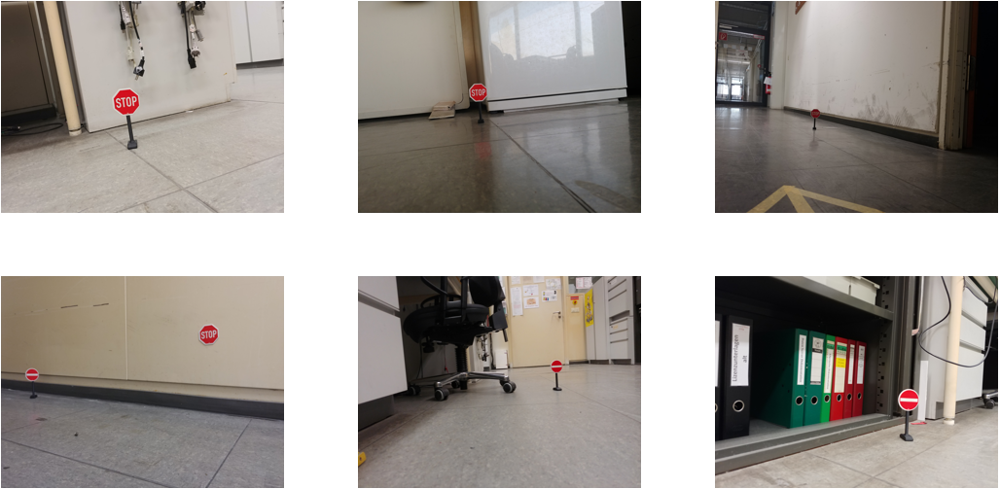
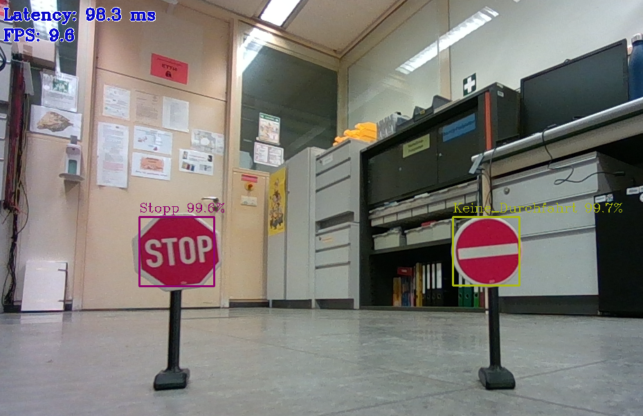
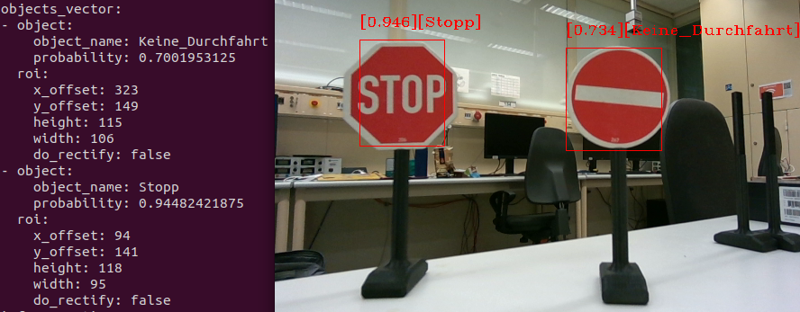

#German Traffic Sign Detection 

##Introduction 

The project describes a workflow beginning with learning a high-level tensorflow object detection network 
and ending with execution in ROS2 on the robot [Robomaker](https://up-board.org/up-squared-robomaker-pro-kit/)
on the Intel hardware Myriad Chip (Visual Processing Unit).

A quick overview of the workflow: 

Find/Create the right Dataset for your Robot environment -> Learn your custom [Tensorflow Object Detection](https://tensorflow-object-detection-api-tutorial.readthedocs.io/en/latest/training.html) Network -> Evaluation -> Convert Network with Intel OpenVino
into .xml and .bin File with [OpenVino Model Optimizer](https://docs.openvino.ai/latest/openvino_docs_MO_DG_Deep_Learning_Model_Optimizer_DevGuide.html) --> Use the [ROS2 Openvino Toolkit](https://github.com/intel/ros2_openvino_toolkit) to run the model flexible 
on your robot system. 

The workflow was used to create a model to detect german traffic signs in a laboratory environment. 
 
The work also revolves around the question:
How is deep learning to be reconciled with robot hardware in terms of high-performance and real-time execution?

Two Coco-pretrained Models were used to relearn to detect german signs. 
*Faster RCNN Resnet50 Lowproposals from [TF 1 Detection Model Zoo](https://github.com/tensorflow/models/blob/master/research/object_detection/g3doc/tf1_detection_zoo.md)
*SSD MobileNet V2 FPNLite 320x320 from [TF 2 Detection Model Zoo](https://github.com/tensorflow/models/blob/master/research/object_detection/g3doc/tf2_detection_zoo.md)

German-speakers can read detailed explanations in my master's thesis. 
The Readme ist just a short summary.  

##Find the Dataset 

First idea was to go the easy way and use a already labeled Database, the [German Traffic Detection Benchmark](https://benchmark.ini.rub.de/gtsdb_news.html) with 43 german sign classes. 
There are two problems: 
* The Database has 900 images for 43 signs. Its to small to learn the complexity of the problem. 
* The images are made on german streets. The Robot in this project just drives in a laboratory\office environment. the network must be learned according to the military motto: "Train as you fight"

The solution: Create a own Database with miniature signs. To reduce the work the database only covers two classes. 
140 images were taken with the signs "Stop" and "No passage" and were labeled with the programm [labelImg](https://github.com/tzutalin/labelImg).
The Database is located in TFOD\TF_2\training\images separated in test and train database.

  

##Tensorflow Object Detection API(TFOD)
TFOD was used to relearn COCO-trained models to the custom german sign Dataset. 
The project follows the instruction of this [tutorial](https://tensorflow-object-detection-api-tutorial.readthedocs.io/en/latest/training.html).
Broken down to the most important you need to transform your Database into record files, download a pretrained model from the TF Model Zoo,
download the right software versions, create the right folder structure and many other point... 
The NVIDIA GPU Support was used. The learning phase of the models SSD MobileNet V2 FPNLite 320x320 and Faster RCNN Resnet50 Lowproposals 
were executed on a Nvidia Quadro RTX 4000. 

The folder structure to learn the MobileNet is located in TFOD\TF_2\training\. 
You won't find the pretrained model in TFOD\TF_2\training\pre-trained-models but you can download it in [TF Model Zoo](https://github.com/tensorflow/models/blob/master/research/object_detection/g3doc/tf2_detection_zoo.md)

Some Software versions and learning-parameter to relearn the SSD_Mobilenet: 

| Study Time     | 6.159 h  |
| Lernsteps      | 25000    |
| Batch Size     | 8	    |
| Python Version | 3.7      |
| TF Version     | 2.4.0    |
| CUDA Toolkit V.| 11.0     |
| cuDNN V.       | 8.0.4    |

At the end you need to export the TF Model into a "saved model" format to transform it later with the OpenVINO Software. 
You find the exported model in TFOD\TF_2\training\exported-models. 

##[OpenVino] (https://github.com/openvinotoolkit/openvino) 

OpenVino is software used to convert deep learning models into a compatible and optimized format for Intel hardware.
The purpose here is to convert the model from a TF saved model format into a IR format (Bin and XML File). 
Bin file represents weights and bias. Xml file respresents the model structure. 
The Transformation can be done using the [Model Optimizer](https://docs-openvino-ai.translate.goog/latest/openvino_docs_MO_DG_Deep_Learning_Model_Optimizer_DevGuide.html?_x_tr_sl=en&_x_tr_tl=de&_x_tr_hl=de&_x_tr_pto=op,sc)  

There a two ways to use the Model Optimizer.

Console: The order to tranform SSD_Mobilenet into IR (to reduce computation work on the robot the variables data types are changed from Floating Point 32 to FP 16): 

`python mo_tf.py
−−saved_model_dir my_ssd_mobilenet_v2_fpnlite_320x320\saved_model
−−transformations_config extensions\front\tf\ssd_support_api_v2.4.json
−−tensorflow_object_detection_api_pipeline_config my_ssd_mobilenet_v2_fpnlite_320x320\pipeline.config
−−data_type FP16`

[DL Workbench](https://docs.openvino.ai/latest/workbench_docs_Workbench_DG_Introduction.html): 
A powerfull tool with which you can run almost all OpenVINO functionalities via a graphical user interface. 
For Example: You can get hardware related detailed information of the SSD_Mobilenet: 

        			       |SSD Mobilenet        | Faster RCNN
---      			       |---------	     |--------------
Flop (Number Floating Point Operations)| 1.73 * 10^9	     | 85.08 * 10^9
number of weights  		       | 2.85 * 10^6	     | 28.26 * 10^6
minimial storage capacity              | 4.915 * 10^6	     | 17.28 * 10^6
maximal storage capacity	       | 50.791 * 10^6       | 264.765 * 10^6            	     |

You can find the IR Files of my models in the folder OpenVINO\IR.

To run the IR Files on the the Movidius Myriad X OpenVino offers the Inference Engine.
The Inference Engine provides differnt general demos that you can use for your models. 
In this work the [Object Detection Python Demo](https://docs.openvino.ai/latest/omz_demos_object_detection_demo_python.html) is used.
The requirement is to install OpenVino on the RoboMaker and configure the Movidius VPU in Linux. 
A documentation to install all this in Ubuntu 20.04 LTS with OpenVino 2021.x is on the thesis in chapter 12.3 and 12.4. 

Order to start the detection demo with the IR files of the Mobilenet: 

`python object_detection_demo.py
−−model ...\my_ssd_mobilenet_v2_fpn_320x320\saved_model.xml
−at ssd
−−input 0
−−labels ...\labels.labels
−−device MYRIAD
−−prob_threshold 0.4`

Input 0 means the cam ID. Here the Robomakers Realsense Camera.
Labels lists the sign classes. 
Device is clear and prob_threshold means the demo shows only detection over the threshold 40%. 

 

FPS for the two models running with the Inference Engine: 

	 	 |SSD-Mobilenet      | faster R-CNN Resnet
---      	 |---------	     |--------------
Frames per Second|   12		     | 3
         	 

##[ROS2 OpenVINO](https://github.com/intel/ros2_openvino_toolkit) 

A documentation to install ROS 2 Foxy OpenVino-Toolkit is placed in chapter 12.4 Thesis. 
The installation is based on Ubunto 20.04 LTS and OpenVINO 2021.3. 

ROS2 OpenVINO is not compatible with the faster R-CNN Resnet Model. 
But it does not matter. The Resnet Model is too big to peform in real time on the Myriad X and is not recommended for robot hardware. 

Like the Inference Engine ROS2 OpenVINO provides demos or samples to use with the own detection model. 
You can find them [here](https://github.com/intel/ros2_openvino_toolkit/tree/master/sample). 

The sample is build with a yaml and launch file. The yaml file is used to set the config paramter and the launch file to start the sample. 
For example, to use the pipline_vehicle_detection sample with your model on the Myriad X and Realsensecamera you need to change the parameter in the yaml file.
In folder ROS2_OpenVINO you find the reconfiguration of the yaml file, so you can use it with the MobileNet. 

After the initialization of the Myriad X a window with the RealSense Stream and the Detection of the traffic signs will open. 
In Addition you can tap the data as a ROS Message. To show the ROS2 topic parallel to the stream open a new terminal and use this 
command: 
`ros2 topic echo /ros2_openvino_toolkit/traffic_sign/detected_objects` 

The result with the SSD MobileNet V2 FPNLite: 

Now you are free to use the detection results in your robot system. 

##Conclusion
Finally, it turns out that only the MobileNet can be used profitably with the Myriad X in robotics due to its small size. 
Admittedly, a traffic sign model to detect only two traffic signs is not impressive. But that is not the core work. 
The core work is the workflow, which starts with finding the right data set and ends with an execution of a detection model in ROS2.

